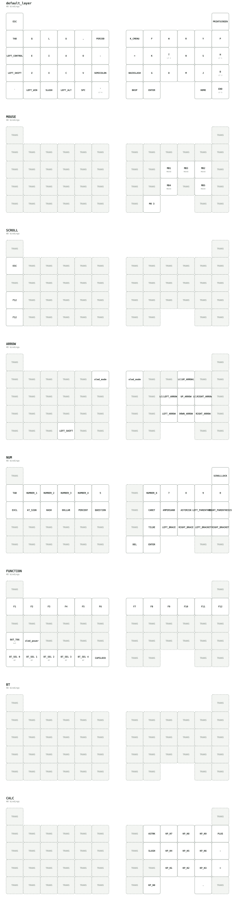

## description
- このキーボードは無線分割式 50% 19mm スライドロータリー トラックボール内蔵のキーボードになります。

## ビルドガイド
- ビルドガイド
  - 作成中

- 購入後のセットアップ
  - https://frequent-breeze-833.notion.site/LoTom-2ace518048a380438cd8c65c32c07ce9

## スペック
- ファームウェア
  - ZMK を使用しています
  - ZMKStudio および DYAStudio に対応しております
- ハードウェア
  - 48 キー
  - choc v2、lofree 系列のスイッチが使用可能
  - 右手側が central,左手側が peripheral になります
  - 両手に OLED 内蔵
  - 左手にサイドにスライドロータリーを２つ内蔵
    - デフォルトでは側面がマウススクロール、底面が音量の上下になっております
  - 右手にサイドにスライドロータリーを1つ内蔵
    - デフォルトではマウススクロールになっております
  - トラックボール19mm
    - ケースごとマグネットで張り付いているので、脱着可能です
  - 単4電池対応 2 つ必要です

## キーマップについて

- DYAStudioにて確認・編集を行なってください
  - https://studio.dya.cormoran.works/

- ZMK keymap-editor も使用できます
  - マクロ設定などを使いたい場合はこちらを使うとべんりです
  - https://nickcoutsos.github.io/keymap-editor
  - ご使用の時は本リポジトリをフォークしてお使いください
    - ※フォークしてマクロ等にパスワードなどを設定する際はリポジトリが public になってしまい情報漏洩につながりますのでご注意ください

### キーマップ図

キーマップを変更すると、GitHub Actions により以下の図も自動更新されます。

### レイヤー

| # | 名称 | 呼び出し | 内容 |
|---|---|---|---|
| 0 | `default_layer` | - | 通常の入力 |
| 1 | `MOUSE` | `H` を長押し | マウスボタン（左・中・右・戻る・進む） |
| 2 | `SCROLL` | `T` を長押し | トラックボールがスクロールになります |
| 3 | `ARROW` | `B` を長押し | 矢印キー・単語移動 |
| 4 | `NUM` | `Tab` を長押し | 数字と記号 |
| 5 | `FUNCTION` | `End` を長押し | F1〜F12、Bluetooth プロファイル切り替え |
| 6 | `BT` | - | 未使用の予備レイヤーです |
| 7 | `CALC` | `メニュー` キーを長押し | テンキー |

- デフォルトのトラックボールの cpi は 600cpi です
- レイヤー 2 では慣性スクロールが効きます。ボールを弾いて離すと、スクロールが減衰しながらしばらく続きます
- Bluetooth のペアリング先を切り替えるにはレイヤー 5（`End` 長押し）の最下段を使います
  - 同じくレイヤー 5 の `Z` の位置で、出力先（USB / Bluetooth）を切り替えられます
  - レイヤー 5 の `X` の位置で、両手の OLED をまとめて消灯 / 点灯できます
    - 消費電力の大半は OLED なので、電池を持たせたいときはここで消してください
    - 選んだ状態は保存され、電池を入れ替えても維持されます

## その他

不明な点がある場合は下記アカウントにご連絡ください
https://x.com/tomcat09131
